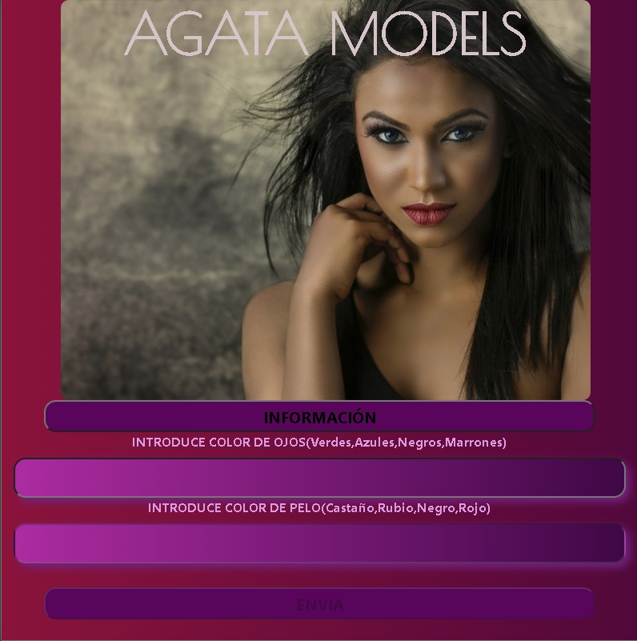

<h1>webModels</h1>

Presentación de blog buscador de modelos . Por medio de unos formularios , introducimos las características de las chicas que queremos contratar para un trabajo determinado y nos aparecen las disponibles en la agencia. 

<h2>Lenguaje</h2>

Javascript

<h2>Framework</h2>

React

<h2>Código</h2>

Componentes de clase

<h1>Enlace a vídeo en You Tube</h1>

 <a href="https://youtu.be/VRQz1wNqZ2E">ACCEDE A VÍDEO EN YOU TUBE</a> 